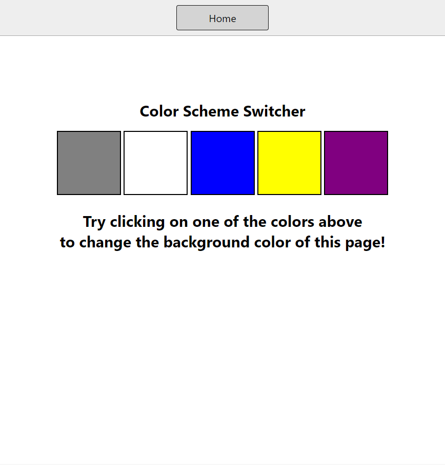
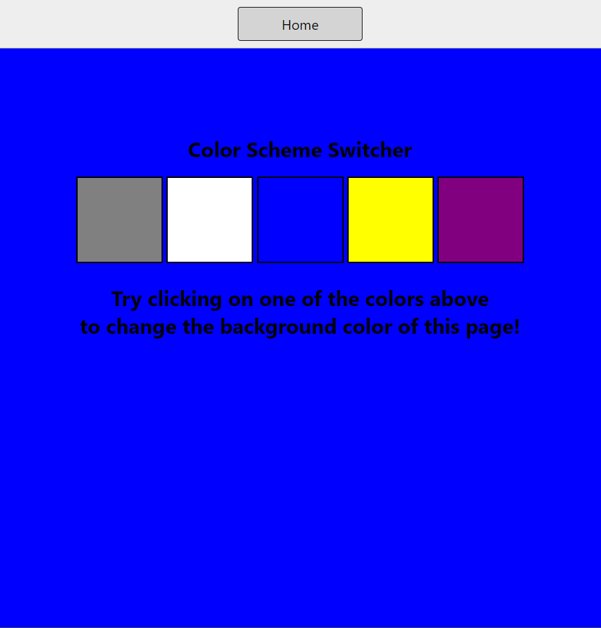
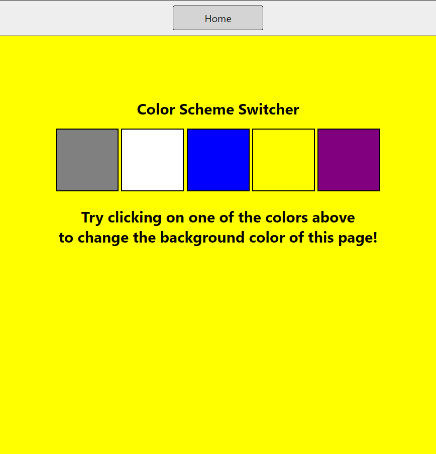

# Projects Related to DOM

## Project link
[Click Here](https://stackblitz.com/edit/dom-project-aaryanpathak)   

# Solution Code

## Project 1


## HTML Code

``` HTML
<!DOCTYPE html>
<html lang="en">
  <head>
    <meta charset="UTF-8" />
    <meta name="viewport" content="width=device-width, initial-scale=1.0" />
    <meta http-equiv="X-UA-Compatible" content="ie=edge" />
    <link rel="stylesheet" href="style.css" />
    <link rel="stylesheet" href="../styles.css" />
    <title>JavaScript Background Color Switcher</title>
  </head>
  <body>
    <nav>
      <a href="/" aria-current="page">Home</a>
      
    </nav>
    <div class="canvas">
      

      <h1>Color Scheme Switcher</h1>
      <span class="button" id="grey"></span>
      <span class="button" id="white"></span>
      <span class="button" id="blue"></span>
      <span class="button" id="yellow"></span>
      <span class="button" id="Purple"></span>
      <h2>
        Try clicking on one of the colors above
        <span>to change the background color of this page!</span>
      </h2>
    </div>
    <script src="chaiaurcode.js"></script>
  </body>
</html>
```
## CSS Code

``` CSS
html {
  margin: 0;
}

span {
  display: block;
}
.canvas {
  margin: 100px auto 100px;
  width: 80%;
  text-align: center;
}

.button {
  width: 100px;
  height: 100px;
  border: solid black 2px;
  display: inline-block;
}

#grey {
  background: grey;
}

#white {
  background: white;
}
#blue {
  background: blue;
}
#yellow {
  background: yellow;
}
#Purple {
  background: purple;
}
```
## Javascript

``` Javascript
const buttons = document.querySelectorAll('.button');
const body = document.querySelector('body');

buttons.forEach(function (button) {
  console.log(button);
  button.addEventListener('click', function (e) {
    console.log(e);
    console.log(e.target);
    if (e.target.id === 'grey') {
      body.style.backgroundColor = e.target.id;
    }

    if (e.target.id === 'white') {
      body.style.backgroundColor = e.target.id;
    }

    if (e.target.id === 'blue') {
      body.style.backgroundColor = e.target.id;
    }

    if (e.target.id === 'yellow') {
      body.style.backgroundColor = e.target.id;
    }

    if (e.target.id === 'Purple') {
      body.style.backgroundColor = e.target.id;
    }

  });

});

```

# Project Images


#

